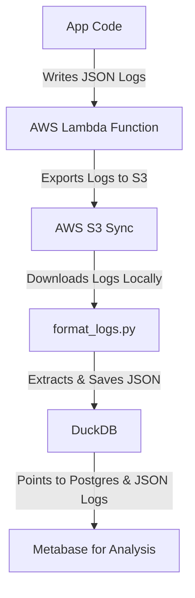

# QuackMeUp: Turnkey Data Analysis Using DuckDB and Metabase for Postgres & CloudWatch
:duck: _Dive into the world of data with a quack!_

## Overview
QuackMeUp is an open-source, Python-based toolkit designed to simplify the integration and analysis of data from various sources like PostgreSQL and AWS CloudWatch, using the power of DuckDB and Metabase. It's a one-stop solution for software engineers and data analysts looking to quack their way through data aggregation, transformation, and visualization.

### Key Features
- **Effortless Integration**: Seamlessly connect with PostgreSQL databases and CloudWatch logs.
- **Python-Powered**: Leverage the simplicity and flexibility of Python for data manipulation.
- **DuckDB at its Core**: Utilize DuckDB's OLAP capabilities for efficient data querying and analysis.
- **Metabase Visualization**: Transform data into insights with intuitive Metabase dashboards.
- **Modular Design**: Flexible architecture allows easy extension and customization.

### End-to-End Data Pipeline for Business Analytics

## Installation

### Install the dependencies

  1. [Install Docker](https://docs.docker.com/get-docker/)
  1. [Install the awscli](https://docs.aws.amazon.com/cli/latest/userguide/getting-started-install.html) and run `aws configure`
  1. Install Python, e.g. `brew install python@3.11`
  1. `python3.11 -m pip install poetry`
  1. `poetry install`
  1. Install the Git hooks for code formatting with black: `poetry run pre-commit install`
  1. Install DuckDB, e.g. `brew install duckdb`

### Configure the .env file

  1. `cp .env.example .env` and then edit `.env`
  1. Choose a value for `TERRAFORM_BUCKET_NAME` that will be unique across all AWS users, e.g. `myorg-quackmeup-terraform-bucket`, where `myorg` is a unique name for your organization. This bucket will be used to remotely store your Terraform state.
  1. Choose a value for `LOGS_BUCKET_NAME` that will be unique across all AWS users, e.g. `myorg-quackmeup-logs`, where `myorg` is a unique name for your organization. This bucket will be used to store logs exported from CloudWatch.
  1. Be sure to substitute the value of `PG_CONNECTION_STRING` with the connection string for your Postgres instance. Ideally, you’d use the connection string for a read replica.
  1. You can leave the rest of the values in `.env` intact unless you prefer them to be different.

### Deploy the infrastructure

  1. [Install Terraform](https://developer.hashicorp.com/terraform/tutorials/aws-get-started/install-cli#install-terraform)
  1. Load the AWS Console and manually create an S3 bucket with the same name that you specified for `TERRAFORM_BUCKET_NAME`.
  1. Initialize the terraform environment: `./terraform/init.sh`
  1. Make sure the terraform plan doesn't error out: `./terraform/plan.sh`
  1. The following `apply.sh` script will then:
    - Create an S3 bucket for `LOGS_BUCKET_NAME`
    - Create an ECR repository for the Lambda code
    - Build and push a Docker image to this ECR repository
    - Schedule a Lambda that will export the latest CloudWatch logs to the S3 bucket every 4 hours
    - Create IAM policies and roles as needed
  1. Deploy the infrastructure: `./terraform/apply.sh`

### Tag target logs for export

Open the AWS Console and navigate to CloudWatch Log Groups. For each log that you wish to be exported to S3, simply add a tag with the key=`ExportToS3` and value=`true`. The log exporter Lambda runs every 4 hours so you'll have to wait at least 4 hours before you start seeing any data in the S3 bucket.

### Install QuackMeUp

  1. Create the DuckDB instance: `./scripts/duckdb/create_db.sh`
  1. Attach the Postgres instance to DuckDB: `./scripts/duckdb/attach_postgres.sh`
  1. Build the Docker image that will run Metabase with DuckDB support: `./scripts/metabase/build_docker.sh`
  1. Run the Docker containers: `docker-compose up -d`
  1. Seed the Metabase config so that you can just log in: `./scripts/metabase/import_db.sh`

## Execute the pipeline

After the logs have been updated, run the following pipeline to ingest the updated data into DuckDB:

  1. Use `s3 sync` to download the logs from S3: `./scripts/s3/download_logs.sh`. Note: if you have a lot of data, this can take a while when it is first run.
  1. Run a Python script to extract the JSON payloads in the logs so that they can be analyzed with DuckDB: `make format_logs`
  1. Create a DuckDB table pointing to the logs: `./scripts/duckdb/import_logs.sh`
  1. Restart Metabase so that it loads the updated DuckDB: `docker restart quackmeup-metabase-1`

## Accessing Metabase

Visit [http://localhost:3000](http://localhost:3000) and log in with:

  - Email: quackmeup@example.com
  - Password: E!v_#nc$48pqfZJ

## Troubleshooting

DuckDB is incredibly fast because it stores a substantial amount of data in memory. If you encounter errors related to insufficient memory, it's advisable to open the Docker console and increase the memory allocation. In our experience, for processing 3GB of zipped logs, we needed to increase the memory allocation to 10GB. Alternatively, you can modify the format_logs.py script so that it filters out any JSON data that you don’t need.

## Starting fresh

  1. `docker-compose down`
  1. `./scripts/metabase/delete_pgdata.sh`
  1. `./scripts/duckdb/drop_db.sh`
  1. Then repeat the installation

## Validating the terraform config

`./terraform/validate.sh`

## Destroying the infrastructure

`./terraform/destroy.sh`

## Running the tests

`make lint`

`make mypy`

`make test`
`make test ARGS="-k test_extract_json_part"`

`make ci`
